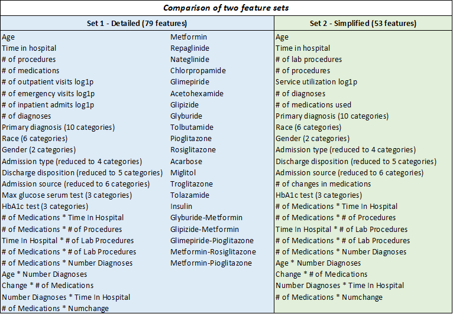

# Readmission-Prediction
In this notebook, I used simple machine learning techniques to analyze healthcare data in interesting and meaningful ways and build predictive models with 94% accuracy.

### Why hospital readmissions matter?
A hospital readmission is when a patient who is discharged from the hospital, gets re-admitted again within a certain period of time. Hospital readmission rates for certain conditions are now considered an indicator of hospital quality, and also affect the cost of care adversely. 

For this reason, Centers for Medicare & Medicaid Services established the [Hospital Readmissions Reduction Program](https://www.cms.gov/medicare/medicare-fee-for-service-payment/acuteinpatientpps/readmissions-reduction-program.html) which aims to improve quality of care for patients and reduce healthcare spending by applying payment penalties to hospitals that have more than expected readmission rates for certain conditions. Although diabetes is not yet included in the penalty measures, in 2011, American hospitals spent over [$41 billion on diabetic](https://www.hcup-us.ahrq.gov/reports/statbriefs/sb172-Conditions-Readmissions-Payer.jsp) patients who got readmitted within 30 days of discharge. Being able to determine factors that lead to higher readmission in such patients, and correspondingly being able to predict which patients will get readmitted can help hospitals save millions of dollars while improving quality of care. So, with that background in mind, we used a medical claims dataset (description below), to answer these questions:

* What factors are the strongest predictors of hospital readmission in diabetic patients?
* How well can we predict hospital readmission in this dataset with limited features?

### Choosing a dataset
Finding a good dataset is one of the first challenges (besides defining a meaningful question), when trying out machine learning methods. The current state of the healthcare world is such that we can easily find datasets that rich (full of useful information) but messy (unstructured content or messy schemas) or datasets that are very clean but otherwise sterile in terms of information contained.

With this limitation, I picked a publicly available dataset from [UCI repository](https://archive.ics.uci.edu/ml/datasets/diabetes+130-us+hospitals+for+years+1999-2008#) containing de-identified diabetes patient encounter data for 130 US hospitals (1999–2008) containing 101,766 observations over 10 years. The dataset has over 50 features including patient characteristics, conditions, tests and 23 medications. Only diabetic encounters are included (i.e. at least one of three primary diagnosis was diabetes).

### What preprocessing and feature engineering techniques should be applied?
Before we can get to actual modeling, some wrangling with the data is almost always needed. We applied three types of methods here:

* Cleaning tasks such as dropping bad data, dealing with missing values.
* Modification of existing features e.g. standardization, log transforms etc.
* Creation or derivation of new features, usually from existing ones.

### Feature sets for modeling 
While there are many possible combinations of features one could test for, I wanted to test two versions — one relatively complex model containing detailed features and a simpler one with fewer and some composite features I had created e.g. number of inpatient, outpatient and emergency visits were included in complex feature set, and replaced with composite feature (service utilization) in the simple feature set. Both sets are shown below.

### Selecting models
Our choice of models is governed primarily by our aim to understand the most important factors, along with their relative effects on medication change and readmission. Thus, while model accuracy is important, model interpretability in order to devise corrective measures is a key criterion for our model selection. The models that we implemented include:

1. Logistic regression: With the starting assumption that the impact of factors and their interactions can be modeled as a log likelihood of outcome, logistic regression can help us understand the relative impact and statistical significance of each factor on the probability of readmission. We handled missing values by either removing the columns or following the preprocessing steps as described in the previous post. We tried both L1 and L2 regularization to penalize complex models and found little improvement (since we had made features normal or gaussian like after log transformation). We also tried Randomized Logistic Regression to get the most important features for our logistic regression model but got poor performance metrics than the feature sets considered above and hence, we decided to stick with the feature sets above to maintain consistency.

2. Decision Trees: By iteratively and hierarchically observing the level of certainty of predicting whether someone would be readmitted or not, we find the relative importance of different factors using a more human-like decision making strategy in establishing this determination.

3. Random Forests: By considering more than one decision tree and then doing a majority voting, random forests helped in being more robust predictive representations than trees as in the previous case. For both Decision Trees and Random Forests, we removed the interaction terms from the feature set since these are already accounted for in tree based models.

I did not use the following types of models:

1. K-nearest Neighbors: While K-nearest neighbors provide decent predictions, they cannot help in deciding the features that contribute to this decision the most, since features are weighted equally (assuming we normalize them) based on simply their contribution to the proximity/distance function.

2. Support Vector Machines: Support Vector Machines can help model linearly inseparable data, thus allowing us to explain complex non-linear relationships. However, because of high-dimensional structure and complexity, they are limited by their interpretability to gain insights on how different features are weighted/assigned importance.

3. Naive Bayes: Naive bayes uses time-sequence information of what came before (prior) and what came after (posterior) the variable being predicted. This could be useful but since we did not have data on which medicine was given before and which after, and the features available have little or no time-based ordering, using Naive Bayes would result in a model that is not interpretable.

4. Neural Networks: Again, these may possibly produce highly accurate results (assuming the features contain the predictive information), but pretty much lack interpretability.

So from the perspective of a hospital manager, models that are not interpretable would not providing much actionable information.

### The results 
1. Logistic regression:

The model accuracy (with cross validation) is 61% (i.e. Classification error of 39%) for complex feature set with a Recall of 55%. A similar analysis using the reduced feature set gives almost the same results. At this point, it seems like model isn’t performing very well in terms of accuracy and error metrics. 

2. Decision Trees:

With 91% accuracy, it's much improved in all metrics compared to logistic regression. Note that there are several model parameters for fine-tuning such as depth of tree, minimum sample size and type of information gain function (gini vs entropy) etc. One should ideally implement a grid search to find the optimal parameters for best performance (assuming the computation isn’t taking too much time).

3. Random Forests:

Forests are made of up trees. Random forests are made up of randomly grown trees. In machine learning lingo, this method means that instead of relying on a single decision tree, we try many different trees with randomly assigned subsets of features. The final prediction is then calculated by voting across predictions made by all the trees in the forest. 
After applying Random Forest, the accuracy was 94% regardless of using Gini or Entropy function.

Same accuracy (94%) for the simpler model, but the top feature importances differed slightly compared to the complex model:

#### The conclusion:

The decision tree model indicates highest importance of time spent in hospital, age and discharge to another hospital for both simple and complex versions. For random forest ensemble, the same features had high importance, although the distribution was more even as compared to decision tree. This is likely due to stabilization of importances across many trees.

The difference between performance of logistic versus tree based models is remarkable (61% vs. 94%). Besides accuracy, recall is important here since hospitals get penalized and incur additional costs both for the patient and the insurance agencies if a patient expected not to be readmitted shows up in 30 days.

### Limitations
The dataset at hand provides some really useful information, both demographic and attitudinal, about hospital readmissions in patients. However, a key thing to understand here is that the quality of predictions depend not only on the volume of data available, but on variety as well. We are limited by the information at hand, which is a comprehensive but not an exhaustive account of all the factors that may affect hospital readmissions. Besides other factors mentioned above, the dataset does not include many important factors such as access to care, which has been shown in [one study to account for 58%](https://onlinelibrary.wiley.com/doi/full/10.1111/1475-6773.12177) of variation readmission rates. 
There may be many other factors depending on situation, that could be affecting readmissions. Moreover, availability of data spanning across longer periods of time can also significantly contribute towards the performance of the models. While the high performance is attributable partially to the synthetic data created using SMOTE, we can say that the performance would be around that, within conservative error estimates, for real life data. Undersampling would be a preferred method if large enough dataset is available. The logistic model showed a poor Pseudo R-Squared value, which may point towards a lot of noise in the data but it is not a good measure of fit for logistic models In fact, some researchers do not report this value for logistic models at all, in order to avoid creating confusion. However, the effects are still statistically significant based on the Likelihood Ratio tests for both.

### What next?
There are many more techniques to try, parameters to refine and feature selection methods to use. One could also imagine complementing the dataset with some external information to improve it. However, we can say something about the overall process:

1. Considering accuracy of predicting outcomes, tree based models are clearly outperforming logistic regression, perhaps because decision boundaries are non-linear or there are complex time-sequence dependent interactions between the things happen to a patient during a hospital stay.
2. Machine learning techniques can allow nuanced analysis of predictors. For example, we see that the regression coefficient is highest for a certain type of discharge (to another unit), but time spent in hospital is the most important feature when using decision tree. However, visualizing the tree shows that both of these features appear above/below each other, which indicates high interaction. One might then include this interaction term in the logistic model and see improvement. For a hospital manager, this means that patients who are likely to stay longer and then get discharged to another unit, are highly likely to get readmitted.
